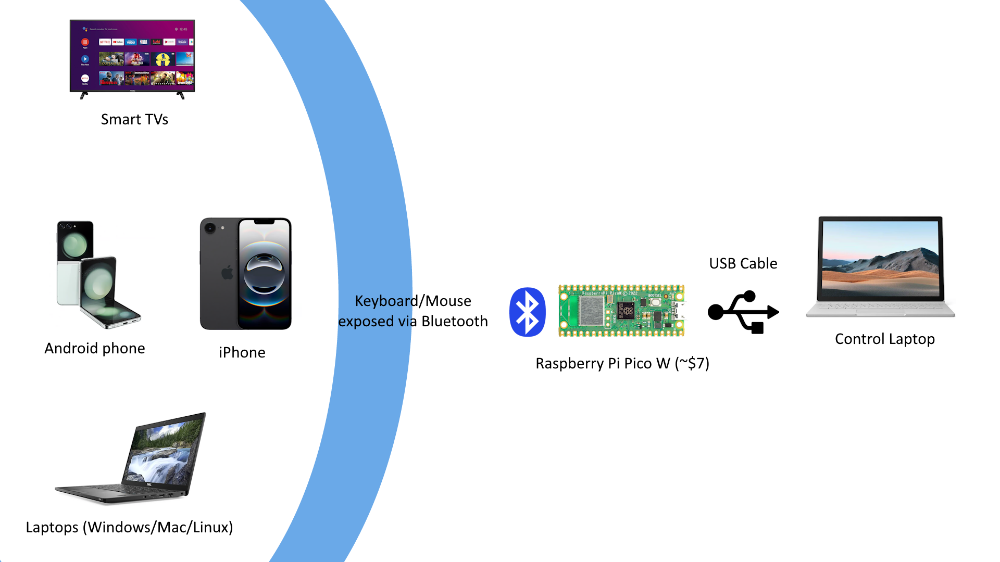
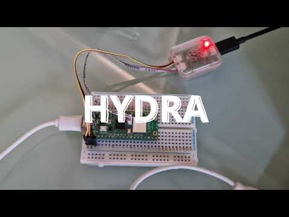

# Hydra

Hydra controls any number of remote devices pretending to be a bluetooth mouse and keyboard. You can pair hydra to your phone, another laptop, smart tv and so on.

Hydra is a hardware+software solution, because most of the operating systems (Windows, MacOS) either block ability to run as a bluetooth peripherial, or really poorly implement it.

You need Raspberry Pi PICO W (costing around $7) hardware to run Hydra hardware stack, which is orders of magnitude cheaper than alternative paid solutions. Included uf2 firmware makes Pico a virtual bluetooth keyboard+mouse, and transforms Pico USB port into serial COM interface, which means you don't need any drivers at all.

Because Hydra dongle is a normal serial port, you can even communicate with it using any standard COM software (Putty or MobaXTerm on Windows).

Included client for Windows is a super efficient controller that allows redirecting local keyboard and mouse with a press of a hotkey to a remote bluetooth device.

Watch YouTube video to see this in action:

